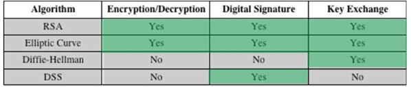
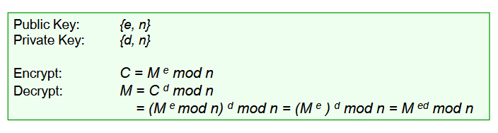
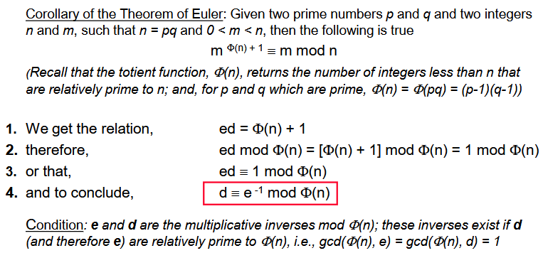
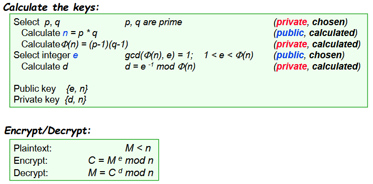

# Asymmetric Encryption & Hash Functions

## Applications

## Symmetric vs Asymmetric
- Symmetric algorithms are generally faster than asymmetric algorithms.
- If the algorithms are secure, the key size is what matters most.

## Requirements
- Trap-door one-way function
	- A one-way function allows easy computation of ( X = F(Y) ) but is difficult or impossible to reverse.
	- A trap-door one-way function allows easy computation of ( X = F_k(Y) ) and easy reversal, thanks to a secret key ( k ).

## RSA Algorithm
1. Divide the data into blocks.
2. The block size is limited by ( n ): ( 2^x < n ), where ( x ) is the block size.

### RSA Example

### RSA Security

#### Brute Force Attacks
- These attacks test all possible keys until one successfully decrypts the message.
- **Solution**: Increase key size, though this slows down the process.

#### Mathematical Attacks
- These attacks attempt to factor n into its two prime numbers, p and q (i.e., (Phi(n) = (p-1)(q-1)) and (d = e^-1 mod Phi(n))).
- Current algorithms are not very effective for large numbers, but improvements are ongoing.
- To increase difficulty:
	- p and q should have approximately the same number of bits.
	- (p-1) and (q-1) should have a high prime factor.
	- gcd(p-1, q-1) should be small.
- Keys with 2048 bits are expected to provide a sufficiently secure level.

#### Timing Attacks
- These attacks measure the time taken for certain operations during decryption.
- **Example**: In the calculation (m mod n), results are obtained bit by bit, requiring an additional multiplication modulo n when the exponent bit is 1.
- Attackers do not need to know the plaintext:
	- If the execution time is consistently slow, the bit is likely 1.
	- If one execution is fast, the bit is likely 0.
- This process can continue with subsequent bits to determine the entire key.