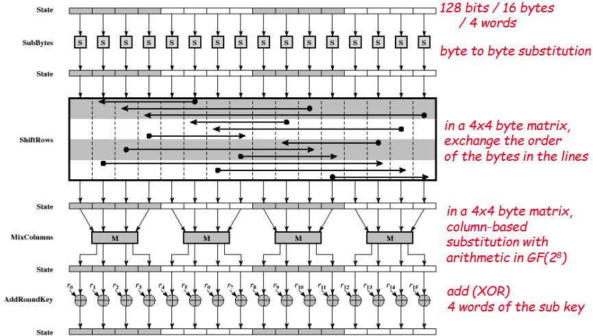

# Symmetric Encryption

## Introduction
Symmetric cryptography is an encryption method where the same key is used for both encryption and decryption. It is widely used due to its efficiency but requires secure key management.

### Basic Concepts
1. **Types of operations**
    - **Substitution**: Replaces elements with others.
    - **Permutation**: Rearranges elements within the data.
    - **Mathematical operations**: Various transformations based on mathematical functions.
2. **Number of keys**
    - **Symmetric encryption**: Uses a single key for encryption and decryption.
	- **Asymmetric encryption**: Uses a key pair (public and private).
3. **Processing methods**
    - **Block cipher**: Encrypts data in fixed-size blocks.
    - **Stream cipher**: Encrypts data bit by bit or byte by byte.

### Security Considerations
- **Kerckhoffs' Principle**: Security should depend only on the secrecy of the key, not the algorithm.
- **Attack Methods**:
	- **Cryptanalysis**: Exploits algorithm weaknesses.
	- **Brute-force Attack**: Tries all possible keys, mitigated by increasing key size.

## Block Ciphers
A block cipher encrypts fixed-size blocks of plaintext into ciphertext.

- **Reversible transformation**: Decryption is possible; each plaintext block corresponds to a unique ciphertext block.
- **Irreversible transformation**: Decryption may not be possible.

An **ideal block cipher algorithm** would allow all possible reversible transformations, meaning (2^n)! transformations, where n is the block size in bits. In practice, only (2^k)! of (2^n)! are possible, where k is the key size in bits.

### Cipher Types
- **Substitution cipher**: Replaces elements (e.g., "aac" -> "BBD").
- **Permutation cipher**: Rearranges elements (e.g., "aac" -> "CAA").
- **Product cipher**: Combines substitution and permutation for enhanced security.
- **Feistel cipher**: Splits plaintext into two halves, applies function F with a subkey, swaps halves iteratively. Used in DES.
### Feistel Structure
The plaintext is divided into two halves (left and right). In each round:
1. **Substitution:** The right half is processed through function F using a subkey.
2. **XOR Operation:** The result is XORed with the left half.
3. **Permutation:** The halves are swapped.
 This process is repeated for multiple rounds, at the end a last swap (permutation) is made to simplify decryption, after which the halves are recombined to produce the final ciphertext. This structure allows decryption by applying the same process in reverse, using the subkeys in reverse order.

The exact implementation depends on:
- block size: larger results in higher security but in slower execution
- key size: larger improves security but may increase execution time
- number of iterations: larger gives more security but reduces performance
- sub-key generation algorithm
- function F()

#### Principals for the Design
- **Number of rounds:**
	- should be chosen in a way that the cryptanalytic effort requires greater effort than brute-force key search
- **Function F:**
	- difficult to find out how to undo the substitution, e.g., should be non-linear
	- changing 1 bit = 50% changing every bit

### Data Encryption Standard (DES)
A symmetric block cipher using a Feistel structure to encrypt 64-bit blocks with a 56-bit key over 16 rounds.

#### DES Structure
1. **Initial Permutation (IP)**: Rearranges the bits of the plaintext.
2. **Feistel Rounds (16 rounds)**:
    - The 64-bit block is divided into two 32-bit halves (L and R).
    - The right half (R) is expanded to 48 bits using an **expansion permutation**.
    - XOR operation is applied between the expanded R and a round-specific 48-bit subkey.
    - The result passes through S-Boxes (Substitution Boxes), reducing it back to 32 bits.
    - A final P-Box permutation is applied.
    - The result is XORed with the left half (L).
    - Left half (L) becomes the previous right half (R).
3. **Final Permutation (FP)**: The final transformation produces the ciphertext.

#### Variants

##### Double DES (2DES)
Encrypts twice using two different keys.
- C=EK2(EK1(P))
- P=DK1(DK2(C))

More resistant to brute-force attacks but vulnerable to the **Meet-in-the-Middle Attack**.

**Meet-in-the-Middle Attack** reduces complexity to 2^(k+1) encryptions and requires 2^k memory.

##### Triple DES (3DES)
- **With Two Keys**: Uses encryption-decryption-encryption (EDE) sequence to improve security.
	- C=EK1(DK2(EK1(P)))
	- P=DK1(EK2(DK1(C)))
- **With Three Keys**: Further increases security with three independent keys:
	- C=EK3(DK2(EK1(P)))
	- P=DK1(EK2(DK3(C)))
- **With Minimal Key**: Uses key derivation from a smaller secret to generate three effective keys.
	- K1=EX1(DX2(EX1(T1)))
	- K2=EX1(DX2(EX1(T2)))
	- K3=EX1(DX2(EX1(T3)))
	- X1, X2 are the keys
	- T1, T2, T3 are constants that do not need to be secret
	- K1, K2, K3 are the keys to use in the previous algorithm.

### Advanced Encryption Standard (AES)
Successor to DES, encrypting 128-bit blocks with key sizes of 128, 192, or 256 bits.

#### AES Structure
- **SubBytes**: Byte substitution using an S-Box.
- **ShiftRows**: Row-wise shifting.
- **MixColumns**: Column mixing using matrix multiplication.
- **AddRoundKey**: XOR with a subkey.

### Cipher Modes

### XTS-AES (XEX-based Tweaked CodeBook mode with CipherText Stealing)
XTS-AES is a mode of operation designed for encrypting data stored on disks, ensuring confidentiality while preserving sector-level random access. It is based on AES and improves security by introducing a **tweak value**, which varies per data block to prevent identical plaintext blocks from producing identical ciphertext blocks.

#### How It Works
1. **Key and Tweak Generation**  
   - XTS-AES uses **two independent AES keys**:  
     - **K1**: Used for encryption/decryption.  
     - **K2**: Used to generate the tweak value (T).  
2. **Tweak Computation**  
   - The tweak value **T** is derived from the sector number and is encrypted using AES with key **K2**.
   - The tweak undergoes further transformations (multiplication in GF(2¹²⁸)) for each block within the sector.
3. **Encryption Process**  
   - The plaintext is XORed with the tweak.  
   - AES encryption is applied using **K1**.  
   - The result is XORed again with the tweak, producing the ciphertext.
4. **Decryption Process**  
   - The ciphertext is XORed with the tweak.  
   - AES decryption is applied using **K1**.  
   - The result is XORed again with the tweak, restoring the plaintext.

#### Advantages
- **Prevents identical ciphertexts for identical plaintexts** (due to the tweak).
- **Parallelizable**: Can encrypt/decrypt individual blocks independently.
- **Suitable for disk encryption**, preserving random access.

## Stream Ciphers
Encrypts data one symbol (bit or byte) at a time, requiring a strong keystream generator.

### Advantages
- Faster in hardware implementations.
- Low memory usage.
- Minimal error propagation.

### Limitations
- Sometimes lead to inefficient software, though recent proposals have addressed this issue.
- Some algorithms are proprietary (security by obscurity).
- Historically, many algorithms have been broken.

### Working mode

- The Keystream Generator must:
	- Change the key when repetition starts occurring.
	- Be random or close to it: 50% of bits should be 0 and 50% should be 1.
	- Use a key of at least 128 bits.

The same key always produces the same sequence.

### Linear Feedback Shift Registers - LFSR
Generates pseudorandom keystreams.

### ChaCha20 Algorithm
Is used in TLS and as an alternative to AES (in case it becomes insecure).

**Fundamental characteristics:**
- Inputs:
	- 128bit constant
	- 256bit key
	- 32bit initial counter
	- 96bit nonce (random number that doesn't repeat)
	- Arbitrary-length plaintext

#### ChaCha20 Block
1. qround is called with the column values
2. qround is called with the diagonal values

#### ChaCha20 Encryption (& qround)
- qround consists on sum, xor and shift (rotate) operations

## (Pseudo) Random Number Generation
- Cryptographic applications require high-quality pseudorandom numbers.
- There is no way to prove randomness, instead, statistical tests are used.
### Types of Random Generators

#### PRNG Requirements
- Seed must be secure and unpredictable
- Uniformity
- Scalability
- Consistency
- Forward unpredictability
- Backward unpredictability

### Blum Blum Shub (BBS) Pseudorandom Generator
A cryptographic PRNG based on modular arithmetic.

1. Select two prime numbers, p and q, such that their remainder when divided by 4 equals 3.
2. Compute n = p × q.
3. Choose s, which must be relatively prime to n (i.e., neither p nor q should be factors of s).
 

### Pseudorandom Generation with a Block Cipher
- A symmetric block cipher produces an output that is apparently random.
- Two example approaches are based on:
	- Counter mode
	- Output-feedback mode

## Cryptographic Vulnerabilities
- Key length and lifetime.
- Randomness quality.
- Cryptographic algorithm weaknesses.