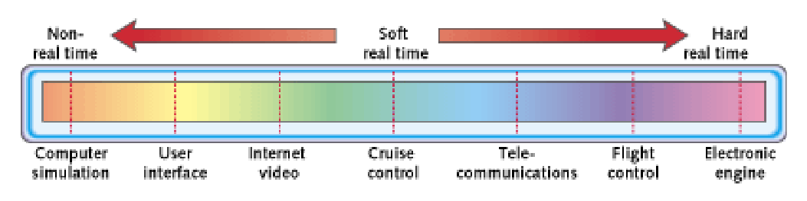

# Introduction to Cyber-Physical, Embedded and Real-Time Systems

## Cyber-Physical Systems (CPS)
Cyber-Physical Systems (CPS) integrate computation, networking, and physical processes. They use sensors and actuators to monitor and control physical systems in real-time, ensuring reliability and efficiency.

### CPS vs IoT
- **Focus**: CPS emphasizes control and automation, while IoT focuses on connectivity and data exchange.
- **Real-Time Processing**: CPS requires strict real-time constraints, whereas IoT applications often tolerate delays.
- **Integration**: CPS deeply integrates computation with physical processes, while IoT primarily connects devices to networks.
- **Applications**: CPS is used in critical systems (e.g., industrial automation, healthcare), while IoT is common in consumer and smart home applications.

## Real-Time Systems (RTS)
Real-Time Systems (RTS) process data within strict time constraints to ensure timely and predictable responses. They are used in critical applications like aerospace, medical devices, and industrial automation.

### Classes
- **Hard real-time systems**: Timing failures must be avoided.
- **Soft real-time systems**: Occasional timing failures are accepted.
- **Mission-critical real-time systems**: Timing failures should be avoided, and occasional failures are handled as exceptional events.

