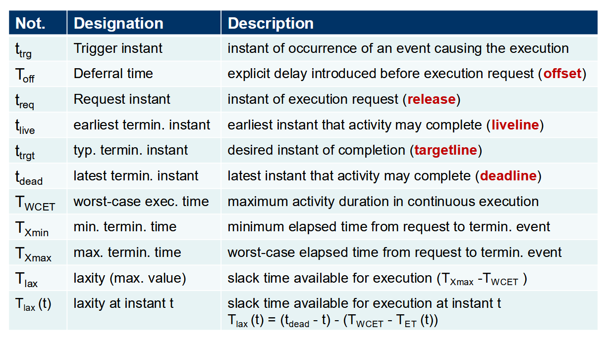
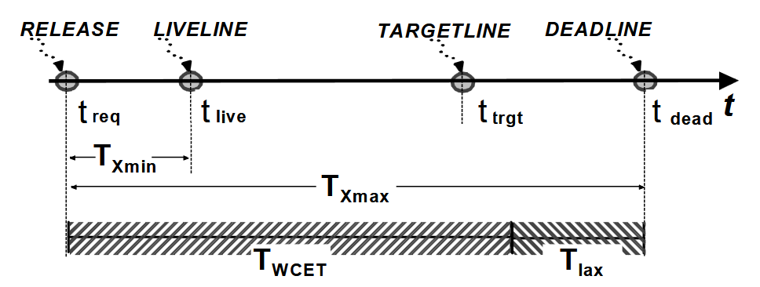
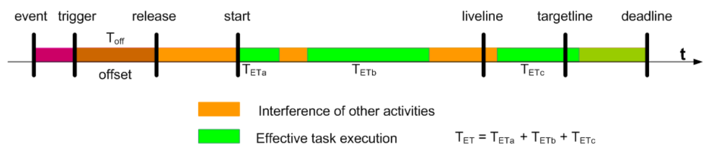
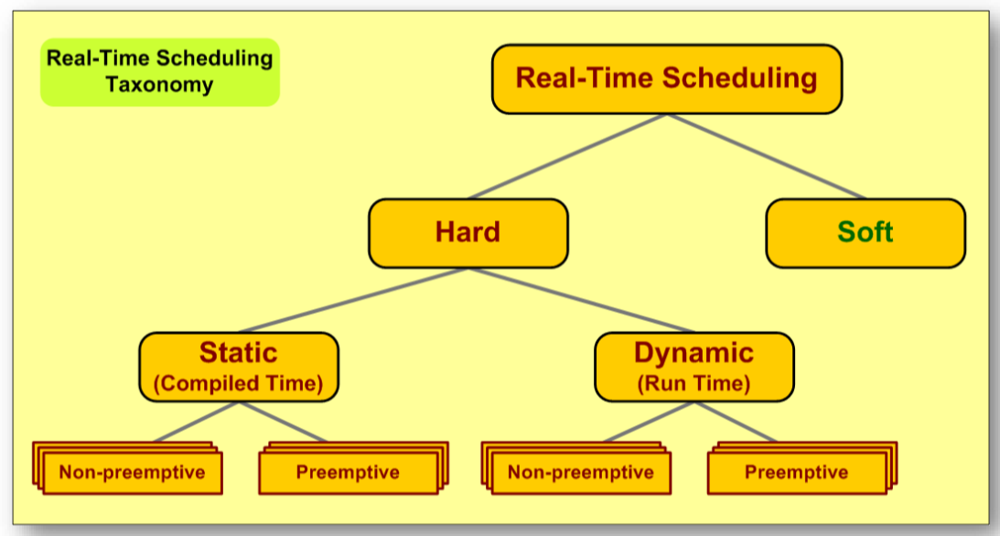
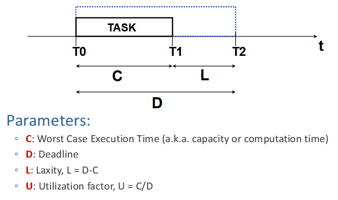

# Paradigms of Cyber-Physical and Real-Time Systems

## Temporal Specifications
- **Deadlines**
- **Sporadic Events** – Example: threshold for triggering alarms
- **Time Lattices**
- **Response Time**
- **Timed Actions**
- **Termination Time**
- **Timing Errors** (e.g., jitter, variance, imprecision)

### Response Time
Response time is the time elapsed from the arrival of an input event to the corresponding output event.

1. Event arrival
2. Identification
3. Processing
4. Output generation
5. Possible transformation of the output into a physical signal
6. Actuation

A system is deterministic if there is a dedicated processor/microcontroller assigned to a single task. However, having 8 cores and 8 tasks does not ensure determinism due to higher-level control layers.

### Timed Actions
A system must perform an action within a specific time frame.
- Converting an analog signal to digital takes time.

### Definition of Timings

### Timing of Events
A system may fail to meet a deadline, but the key aspect is how it handles such failures.

### Event Arrival Characterization

#### Utilization Factor
A measure of the percentage of useful work a resource performs.

#### Processing Resources
Utilization above **70%** is not ideal as it may lead to the inability to handle aperiodic events.

#### Network Resources
(Treatment similar to processing resources)

---

## Scheduling
Scheduling is used to manage system resources efficiently.
- **In real-time systems, swap must be disabled.**

### Scheduling Approaches

#### Static Scheduling

##### Time-Sharing Policy
- Ensures fairness and justice
- Fixed time slice allocation
- Example: UNIX
- Not suitable for highly time-restrictive real-time systems

##### Real-Time Scheduling

##### Time-Triggered Scheduling
- Handles periodic events
- Periodic release of processing tasks

#### Dynamic Scheduling

##### Rate Monotonic (RM)
- Preemptive, fixed-priority-based
- For periodic tasks, priority is inversely proportional to the period

##### Deadline Monotonic (DM)
- Preemptive, fixed-priority-based
- For periodic tasks, priority is inversely proportional to the deadline

##### Earliest-Deadline-First (EDF)
- Preemptive, dynamic-priority-based
- Priority is inversely proportional to the deadline

##### Least-Laxity (LL)
- Preemptive, dynamic-priority-based
- Priority is inversely proportional to the laxity

##### First-Come-First-Served (FCFS)
- Simple, non-preemptive scheduling

#### Centralized vs. Distributed Scheduling
- **Centralized:** A single entity makes scheduling decisions.
- **Distributed:** Decisions are based on multiple entities/nodes.

### Typical Parameters

---

## Schedulability

### Schedulability Testing
Determining the existence (sufficient conditions) or non-existence (lack of necessary conditions) of a feasible schedule for a given problem.

#### Feasibility Testing
Verifies if tasks can be executed with the available resources.

#### Optimal Scheduler
Always finds a feasible schedule if one exists.

### Schedulability Tests
- **Sufficient:** Passing indicates schedulability, failing is inconclusive.
- **Necessary:** Failing indicates non-schedulability, passing is inconclusive.
- **Exact:** Passing confirms schedulability, failing confirms non-schedulability.

### Response-Time Analysis

#### Methodology
1. **WCET (Worst-Case Execution Time)** of each task must be known.
2. Derive the **Worst-Case Response Time (WCRT)** for each task.
3. Consider **Interference (Tint)**.
4. Compare response times with deadlines.

**Response-time-based analysis is an exact test.**

---

## Task Types

### Periodic Tasks
- Triggered by time, occurring at regular intervals.
- Timeliness parameters are known a priori.
- Characterized by **(T, c, d, r, o):**
    - **T:** Period
    - **c:** WCET
    - **d:** Deadline
    - **r:** Release time
    - **o:** First release time
- Example: Monitoring liquid temperature in a tank.
- **Utilization (U) = c / T**

### Aperiodic Tasks
- Triggered by events.
- Timeliness parameters are unknown a priori.
- Characterized by **(a, c, d, r):**
    - **a:** Interval between activations
    - **c:** WCET
    - **d:** Deadline
    - **r:** Release time
- Example: Temperature alarm.

### Sporadic Tasks
- Triggered by events.
- Timeliness parameters are known a priori.
- Characterized by **(m, c, d, r):**
    - **m:** Minimum inter-arrival time
    - **c:** WCET
    - **d:** Deadline
    - **r:** Release time
- Example: Temperature alarm.
- **Utilization (U) = c / m**

---

## Rate Monotonic (RM)
**TODO: Review this section.**

## Earliest-Deadline-First (EDF)
**TODO: Review this section.**